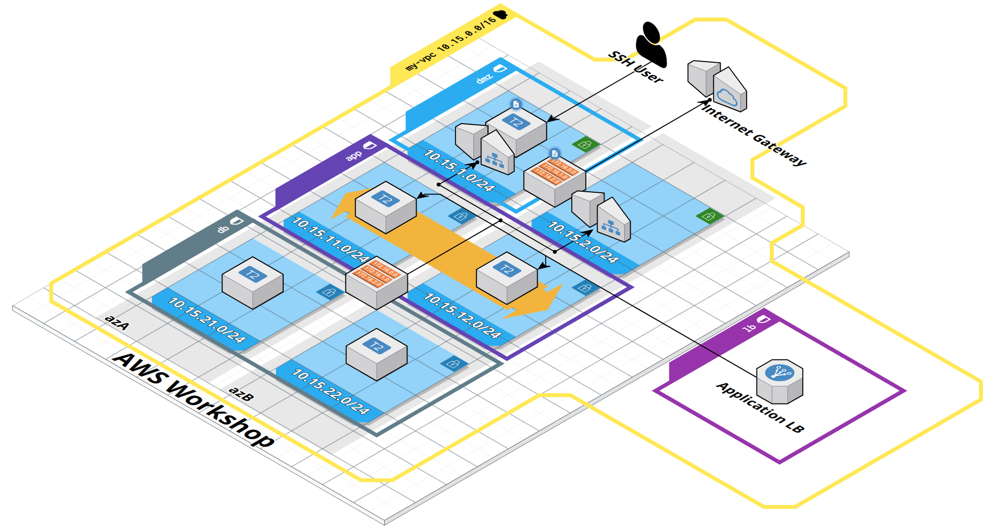
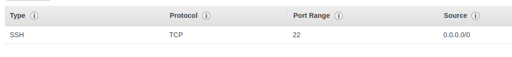
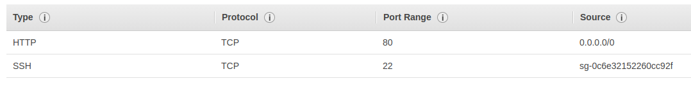
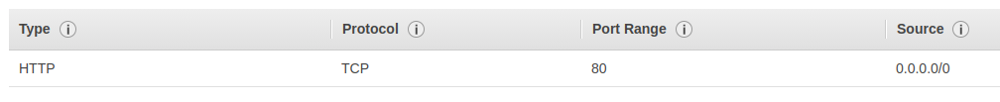

An interactive diagram can be found [here](https://app.cloudcraft.co/view/005b8cfd-95f7-4d19-81a0-e8da1c2d4c63?key=jWz8R9QefwBe7mPq3kOORA).

## 1. VPC

In AWS VPC dashboard, create a new VPC. Name it `<your-name>-vpc` so it's distinguishable from others.
Select IPv4 CIDR block, e.g. `10.10.0.0/16`.

## 2. Internet Gateway

In AWS VPC dashboard select the *Internet Gateway* menu option and create a new Internet Gateway.
Name it `<your-name>-igw`.
Attach it to your recently created VPC.

## 3. Subnets

In AWS VPC dashboard, select subnet tab and create 6 subnets.
Use a naming convention so that subnets are easily distinguishable (e.g. `<your-name>-app-1`).

* created subnets should be in your newly created VPC
* use your own scheme for allocating an IPv4 CIDR block for each subnet, e.g. `10.10.1.0/24` for `<your-name>-dmz-1` and `10.10.2.0/24` for `<your-name>-dmz-2`
* create 2 subnets for DMZ, place them in different availability zones
* create 2 subnets for applications, place them in different availability zones
* create 2 subnets for databases, place them in different availability zones
* a region can have several availability zones, place 3 subnets in `az-1` and the rest in `az-2`

> **Public subnet** is associated with a route table that has a route to an IGW.
> **Private subnet** is associated with a route table that hasn't got a route to an IGW.

## 4. NAT Gateway

NAT Gateways provide access to the Internet for EC2 instances in private subnets.
prevents anybody form outside of the VPC from initiating a connection with EC2 instances that are associated with the NAT Gateway

NAT Gateway must be in a **public subnet**

In AWS VPC dashboard, select *NAT Gateways* menu option and create a new NAT Gateway.

* place the NAT gateway into one of your DMZ subnets
* allocate a new elastic IP address for the NAT gateway

## 5. Route tables

In AWS VPC dashboard, select *Route Tables*.
We're going to create two route tables.
The first one has a route to the Internet Gateway, the other one has a route the NAT Gateway.

Create a route table and name it `<your-name>-rt-igw`.
Place it in your VPC.
It has a _local_ route created for you.
For all other traffic (i.e. `0.0.0.0/0`), add a route to the internet gateway.

Then, create another route table and name it `<your-name>-rt-ngw`.
Place it in your VPC.
Edit its routes and add a route to the NAT gateway.

Finally, associate route tables with subnets.
Select `<your-name>-rt-igw` route table and edit its subnet associations.
Associate it with both of your DMZ subnets.
For `<your-name>-rt-ngw`, associate it with all other subnets.

## 6. Network Access Control Lists (NACL)

NACLs are used to control traffic on the subnet level.

In AWS VPC dashboard, select *Network ACLs*.
Create three Network Access Control Lists, one for each layer in the infrastructure architecture.
Name them based on the subnet, e.g. `<your-name>-dmz-nacl`, `<your-name>-app-nacl` etc.
Place them in your VPC.
Associate NACLs with their respective subnets.
For example, `<your-name>-dmz-nacl` should be associated with `<your-name>-dmz-1` and `<your-name>-dmz-2`.

Inbound/outbound rules for NACLs are stateless.
This means that for an inbound rule, a matching outbound rule must be created.
Otherwise, traffic can only enter a subnet but can never exit it.
Rules are evaluated in the *rule #* order.

### 6.1 DMZ subnet NACL rules

Edit inbound/outbound rules for the `dmz` NACL.
The use cases we want to support are:

* SSH access to bastion host
* app server access to NAT Gateway so they could access the outside world
* incoming HTTP traffic from elastic load balancer

The following is a list of inbound allow rules with their purpose.

| Type            | Protocol | Port Range   | Source        | Description                                                                              |
|-----------------|----------|--------------|---------------|------------------------------------------------------------------------------------------|
| SSH             | TCP      | 22           | 0.0.0.0/0     | Allow SSH access from any source. We want to access our bastion host via SSH             |
| Custom TCP Rule | TCP      | 1024 - 65535 | 0.0.0.0/0     | Allow HTTP traffic to return                                                             |
| HTTP            | TCP      | 80           | 0.0.0.0/0     | Allow incoming HTTP connections from ELB                                                 |
| HTTPS           | TCP      | 443          | 10.10.21.0/24 | Allow incoming HTTPS connections from application servers so they could install packages |
| HTTPS           | TCP      | 443          | 10.10.22.0/24 | Allow incoming HTTPS connections from application servers so they could install packages |

The following is a list of outbound allow rules with their purpose.

| Type            | Protocol | Port Range   | Source        | Description                            |
|-----------------|----------|--------------|---------------|----------------------------------------|
| Custom TCP Rule | TCP      | 1024 - 65535 | 0.0.0.0/0     | Allow client return traffic            |
| SSH             | TCP      | 22           | 10.10.21.0/24 | Allow SSH access to app servers        |
| SSH             | TCP      | 22           | 10.10.22.0/24 | Allow SSH access to app servers        |
| HTTP            | TCP      | 80           | 0.0.0.0/0     | Allow HTTP traffic to exit the subnet  |
| HTTPS           | TCP      | 443          | 0.0.0.0/0     | Allow HTTPS traffic to exit the subnet |

### 6.2 App subnet NACL rules

Edit inbound/outbound rules for the `app` NACL.
The use cases we want to support are:

* SSH access from bastion host
* app server access to NAT Gateway so they could access the outside world and download packages
* Incoming HTTP traffic from ELB via `dmz` subnet

The following is a list of inbound allow rules with their purpose.

| Type            | Protocol | Port Range   | Source       | Description                           |
|-----------------|----------|--------------|--------------|---------------------------------------|
| SSH             | TCP      | 22           | 10.10.1.0/24 | Allow SSH access from bastion host    |
| Custom TCP Rule | TCP      | 1024 - 65535 | 0.0.0.0/0    | Allow returning HTTP/S traffic        |
| HTTP            | TCP      | 80           | 10.10.1.0/24 | Allow incoming HTTP traffic from DMZ  |
| HTTP            | TCP      | 80           | 10.10.2.0/24 | Allow HTTP traffic to exit the subnet |

The following is a list of outbound allow rules with their purpose.

| Type            | Protocol | Port Range   | Source       | Description                                                            |
|-----------------|----------|--------------|--------------|------------------------------------------------------------------------|
| Custom TCP Rule | TCP      | 1024 - 65535 | 10.10.1.0/24 | Allow client return traffic to DMZ                                     |
| Custom TCP Rule | TCP      | 1024 - 65535 | 10.10.2.0/24 | Allow client return traffic to DMZ                                     |
| HTTP            | TCP      | 80           | 0.0.0.0/0    | Allow outbound HTTP traffic (needed to download updates and packages)  |
| HTTPS           | TCP      | 443          | 0.0.0.0/0    | Allow outbound HTTPS traffic (needed to download updates and packages) |

### 6.3 DB subnet NACL rules

Although we created a subnet for databases, in this workshop we're not going to actually place any instances in that subnet.
Therefore we can skip creating the needed NACL rules.

// network diagram needed

## 7. Security Groups

Security Groups are used to control traffic on the instance level.
Compared to NACLs, security group rules are stateful.
There's no need to define a matching outbound rule.
Also, SGs don't have deny rules.

In AWS VPC dashboard, select *Security Groups*.
We're going to create four security groups.
The first one is going to be used for the bastion host.
Second and third groups are going to house app and DB servers respectively.
The fourth one is going to be used by Elastic Load Balancer.
Name your security groups (e.g. `<your-name>-app-sg`), add a description and place them into your VPC.

### 7.1 Bastion host security group

Configure the security group that's responsible for the bastion host.
Edit its inbound rules to only allow access to port 22 (SSH) from all sources.



### 7.2 App server security group

For the app security group, allow SSH traffic (port 22) from bastion host security group and HTTP (port 80) traffic from all sources.



### 7.3 DB server security group

Similarly to DB subnet NACLs, we're not going to implement them during this workshop.

### 7.4 ELB security group

Allow all incoming HTTP (port 80) traffic from all sources.



## 8. Bastion host

In AWS EC2 dashboard, launch a new instance for the bastion host.
A bastion host is an EC2 instance in a public subnet that's used as a _point of entry_ to access EC2 instances in private subnets.
Pick Amazon Linux AMI 2018.03.0 AMI and `t2.micro` as the instance type (it's free tier eligible).
Then click *Configure Instance Details*.
Place the instance in your VPC and select your `dmz-1` subnet.
Also, enable auto-assignment of public IP.
Leave all other options as is.
Click *next* until it's time to configure a security group.
Pick your `dmz-sc` for the security group.
Finally, review and launch the instance.

AWS will ask you to pick a key pair that's used to access the instance.
Crate a new key pair, add a name and then download it.
A `*.pem` file will be downloaded.
Once that's done, launch the instance.
It will take a bit of time for the instance to be ready.

Once ready, in EC2 dashboard, list your instances and connect to your bastion host by clicking *Connect*.
You'll see instructions on how to SSH into the bastion host using the `pem` file you downloaded previously.
If security groups and network access control lists have been configured correctly, you should be able to successfully establish an SSH session.

```
      __|  __|_  )
      _|  (     /   Amazon Linux AMI
      ___|\___|___|

https://aws.amazon.com/amazon-linux-ami/2018.03-release-notes/
```

If the connection hangs, it could be that there's an issue with NACLs or security groups.

## 9 Application servers

In AWS EC2 dashboard, create a autoscaling *launch configuration* that's used by the Auto Scaling Group to create new instnaces.
Use Amazon Linux AMI 2018.03.0 AMI and `t2.micro` as the instance type.
Click next, and configure name and some advanced details.
Set the name to `<your-name>-asg-lc`.
Copy the following to the *User Data* text field.

```
#!/bin/bash
yum update -y
yum install -y httpd
service httpd start
echo "<h1>Hello from $HOSTNAME</h1>" > /var/www/html/index.html
```

This script is executed when the instance starts.
It will install the Apache webserver.
Finally, do not assign a public IP address to any instances.

Click next until you can configure security groups.
Select `<your-name>-app-sg` and finish creating the launch configuration.
Use the previously created keypair when asked to provide one.

Next, let's create an auto scaling group based on the existing launch configuration.
Set the name (e.g. `<your-name>-asg`), pick your VPC, set the initial group size to 2 and then select subnets dedicated to application servers (i.e. `<your-name>-app-1` and `<your-name-app-2>`).
Click next to configure scaling policies.
Keep the group at its initial size for now.
Click *Review* and finish creating the auto scaling group.
It takes a bit of time until the desired instances are created.
Later we'll use load balancers to create access to the web servers.

Once the instances have been created, let's try to SSH into them via the bastion host.
The same keypair is used for all EC2 instances.
In order to access instances in your VPC via the bastion host, you must enable SSH key forwarding.

Start an ssh agent
```
ssh-agent bash
```

Add your key
```
ssh-add /path/to/your/keypair.pem
```

SSH into your bastion host

```
ssh -A ec2-user@<bastion-host-ip>
```

From there, SSH into one of the web servers.
You can find the host name and IP address from EC2 dasboard.
If you have trouble connecting to web servers, have a look at your NACL and security group settings.

## 10. Target groups and load Balancing

Create a new target group.
This specifies the *targets* our load balancer should direct traffic to.
Specify the name (e.g. `<your-name>-tg`), select your VPC and use HTTP for the protocol.
Leave everything else as is.
At the moment, the target group is empty.
It hasn't got any associated EC2 instances yet.
We could add them manually, but since our applications are in an auto scaling group, we would like to avoid manual work.
New instances in an auto scaling group are created and removed automatically.

Open your `<your-name>-asg`, edit it, and attach your existing target group to it.
This registers all targets in the auto scaling group with the target group.
View your target group again.
After a bit of time, you should see all of your EC2 instances in your auto scaling group as targets in the target group.

Next, in AWS EC2 dashboard, go to *Load Balancers* and create an Application Load Balancer.
Add a name (e.g. `<your-name>-app-lb`) and set the scheme to internet-facing.
Leave the listeners as is.
For availability zones, select your VPC and enable it for both availability zones.
Select a *public* subnet per availability zone. (check how this is done in TBL).
Click next until you can configure a security group.
Select your existing `<your-name>-lb-sg` security group.
Finally, click next, select a target group where to route traffic to and finalize the creation of the load balancer.
It takes a bit of time for the provisioning to finish.
Once that's done, get the URL of the load balancer and try to access your web servers.

> **Application load balancer** works on layer 7 of the OSI model (HTTP/HTTPS).
> It supports for host and path based routing.
> It can also route to different applications on a single EC2 instance based on port.
>
> **Network load balancer** works on layer 4 of the OSI model.
> More performant than application LB.