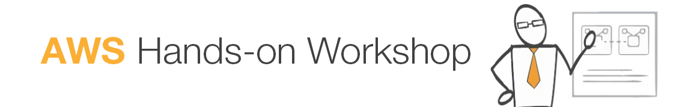
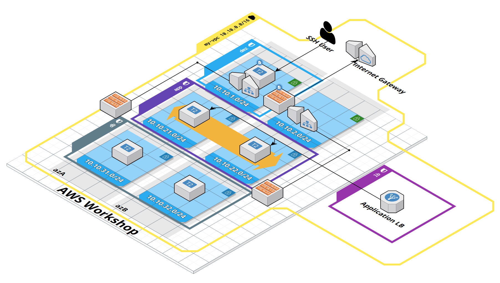
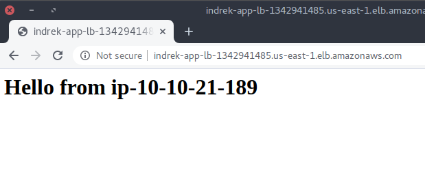

---

This workshop covers the following topics

1. [The creation of a new VPC](#1-vpc)
2. [Internet Gateway](#2-internet-gateway)
3. [Subnets](#3-subnets)
4. [NAT Gateways](#4-nat-gateway)
5. [Route Tables](#5-route-tables)
6. [Security Groups](#6-security-groups-sg)
7. [EC2 and creation of new instances](#7-application-servers)
8. [Autoscaling groups](#72-auto-scaling-group)
9. [Elastic Load Balancers](#8-load-balancing)
10. [RDS Postgres](#9-databases)

The following is a high level architecture diagram of the end result we're going to build.


An interactive diagram can be found [here](https://app.cloudcraft.co/view/005b8cfd-95f7-4d19-81a0-e8da1c2d4c63?key=jWz8R9QefwBe7mPq3kOORA).

## 1. VPC

 [A Virtual Private Cloud (VPC)](https://docs.aws.amazon.com/vpc/latest/userguide/what-is-amazon-vpc.html) is a logically isolated section of the AWS Cloud where you can launch AWS resources in a virtual network.

In AWS VPC dashboard, create a new VPC. Name it `<your-name>-vpc` so it's distinguishable from others.
Select IPv4 CIDR block, e.g. `10.10.0.0/16`.

## 2. Internet Gateway

[An internet gateway (IGW)](https://docs.aws.amazon.com/vpc/latest/userguide/VPC_Internet_Gateway.html) is VPC component that allows communication between your VPC and the internet.

In AWS VPC dashboard select the *Internet Gateways* menu option and create a new Internet Gateway.
Name it `<your-name>-igw`.
Attach it to your recently created VPC.

## 3. Subnets

[A subnet](https://docs.aws.amazon.com/vpc/latest/userguide/configure-subnets.html) is a range of IP addresses in your VPC. You can create AWS resources, such as EC2 instances, in specific subnets.

In AWS VPC dashboard, select the subnet tab and create 7 subnets.
Use a naming convention so that subnets are easily distinguishable (e.g. `<your-name>-app-1`).
The created subnets should be in your newly created VPC

> [!TIP]
> Use your own scheme for allocating an IPv4 CIDR block for each subnet, e.g. `10.10.1.0/24` for `<your-name>-dmz-1` and `10.10.2.0/24` for `<your-name>-dmz-2`

* create 2 subnets for DMZ, place them in different availability zones

> [!NOTE]  
> In networking, a DMZ, or Demilitarized Zone, refers to a segmented part of a network that is isolated and positioned between an organization's internal network (often referred to as the "trusted network") and an external network, typically the internet.
> The purpose of a DMZ is to provide an additional layer of security by placing certain servers and services that require external access in a neutral zone with restricted connectivity.

* create 2 subnets for applications, place them in different availability zones
* create 3 subnets for databases, place them in different availability zones

> [!NOTE]
> A **Public subnet** is associated with a route table that has a route to an IGW. A **Private subnet** is associated with a route table that hasn't got a route to an IGW.


## 4. NAT Gateway

[A NAT gateway](https://docs.aws.amazon.com/vpc/latest/userguide/vpc-nat-gateway.html) is a Network Address Translation (NAT) service.
NAT gateways are used to enable instances in **private subnets** to initiate connections outside of your VPC while preventing inbound traffic from reaching those instances.
A NAT Gateway must be in a **public subnet**

In AWS VPC dashboard, select *NAT Gateways* menu option and create two new NAT Gateways.

* place the first NAT gateway into `dmz-1` and the other one into `dmz-2` subnet
* allocate a new elastic IP addresses for the NAT gateways

> [!NOTE]
> It can take some time for the NAT gateways to be available

## 5. Route tables

[A route table](https://docs.aws.amazon.com/vpc/latest/userguide/VPC_Route_Tables.html) contains a set of rules, called routes, that determine where network traffic from your subnet or gateway is directed.

In AWS VPC dashboard, select *Route Tables*.
We're going to create three route tables.
The first one has a route to the Internet Gateway, the rest will have a route to the NAT Gateway.

Create a route table and name it `<your-name>-rt-igw`.
Place it in your VPC.
It has a _local_ route created for you.
For all other traffic (i.e. `0.0.0.0/0`), add a route to the internet gateway.

Then, create two more route tables and name them `<your-name>-rt-ngw-1` and `<your-name>-rt-ngw-2`
Place them in your VPC and add routes to the NAT gateways.
`rt-ngw-1` should have a route to the NAT gateway that's in subnet `dmz-1`.
`rt-ngw-2` should have a route to the NAT gateway that's in subnet `dmz-2`.

Finally, associate route tables with subnets.
Select `<your-name>-rt-igw` route table and edit its subnet associations.
Associate it with both of your DMZ subnets.
For `<your-name>-rt-ngw-1`, associate it with `app-1` and `db-1` subnets.
`<your-name>-rt-ngw-2` should be associated with `app-2`, `db-2` and `db-3` subnets.

## 6. Security Groups (SG)

[Security Groups](https://docs.aws.amazon.com/vpc/latest/userguide/vpc-security-groups.html) are used to control traffic on the instance level.
Compared to [NACLs](https://docs.aws.amazon.com/vpc/latest/userguide/vpc-network-acls.html), security group rules are stateful.
There's no need to define a matching outbound rule.
Also, SGs don't have deny rules.

In AWS VPC dashboard, select *Security Groups*.
We're going to create three security groups.
The first two are going to house app and DB servers.
The third one is going to be used by Elastic Load Balancer.
Name your security groups (e.g. `<your-name>-app-sg`), add a description and place them into your VPC.

### 6.1 ELB security group

Create a security group for a load balancer that we're going to create later.
Name it `<your-name-lb-sg>`.
Allow all incoming HTTP (port 80) traffic from all sources.

### 6.2 App server security group

Create a new security group for your app servers.
Name it `<your-name>-app-sg`.
For app servers, we want to allow HTTP (port 80) traffic from the ELB security group.

### 6.3 DB server security group

Create a security group for DB servers.
Name it `<your-name>-db-sg`.
Allow incoming traffic on port 5432 from the app security group.

## 7. Application servers

The following section is about creating new EC2 instances that will be serving web traffic.

> [!IMPORTANT]
> Before we're going to configure a launch template, we need to do some prep work.
> We need to configure AWS SSM Session Manager to have access to our EC2 instances.
> This enables us to easily start a terminal session into a running EC2 instance.
> [Follow the guide](https://blog.indrek.io/articles/access-ec2-instance-with-aws-ssm/) that talks about how to set up the required IAM role and how to configure `awscli`.

### 7.1 Launch Template

[Launch template](https://docs.aws.amazon.com/autoscaling/ec2/userguide/launch-templates.html) specifies EC2 instance configuration information.
Auto scaling group will use it to create new EC2 instances.

In the EC2 console, create a new launch template.
Name it `<your-name>-lt`.
Use Amazon Linux 2023 AMI and `t2.micro` as the instance type.
Attach the `app` security group to the launch template.

Select the SSM IAM profile.
Copy the following to the *User Data* text field.

```
#!/bin/bash
yum update -y
yum install -y httpd
service httpd start
echo "<h1>Hello from $HOSTNAME</h1>" > /var/www/html/index.html
```

This script is executed when the instance starts.
It will install the Apache webserver.

### 7.2 Auto Scaling Group

[An Auto Scaling group](https://docs.aws.amazon.com/autoscaling/ec2/userguide/auto-scaling-groups.html) contains a collection of EC2 instances that are treated as a logical grouping for the purposes of automatic scaling and management

In the EC2 dashboard, create a new auto scaling group.
Name it `<your-name>-asg`.
Next, select the launch template that you created in the previous step.
In the next section, configure the auto scaling group to use your VPC.
To ensure that EC2 instances are created in the correct subnets, select the `app-1` and `app-2` subnets.

In the *Configure advanced options* leave everything as is.
In *group size and scaling* set the min and desired capacity to 2.
Click next until you can create the auto scaling group.

Once the auto scaling group is created, AWS will start creating new EC2 instances.
View the *Instances* section in the EC2 dashboard to see the status of the newly created EC2 instances.

## 8. Load Balancing

### 8.1 Target Group

[Target groups](https://docs.aws.amazon.com/elasticloadbalancing/latest/application/load-balancer-target-groups.html) route requests to individual registered targets, such as EC2 instances, using the protocol and port number that you specify.
In our case, it specifies the *targets* our load balancer should direct traffic to.

In AWS EC2 dashboard, create a new target group.
Set the target type to *instances*.
Specify the name (e.g. `<your-name>-tg`), select your VPC and use HTTP for the protocol.
Leave everything else as is.

At the moment, the target group you created is empty.
It hasn't got any associated EC2 instances yet.
We could add them manually, but since our applications are in an auto scaling group, we would like to avoid manual work.
New instances in an auto scaling group are created and removed automatically.

Open the auto scaling group `<your-name>-asg` and edit its load balancing configuration.
Tick the *Application, Network or Gateway Load Balancer target groups* checkbox and from the dropdown select your target group.
This registers all instances in the auto scaling group with the target group.
View your target group again.
After a bit of time, you should see all of your EC2 instances in your auto scaling group as targets in the target group.

### 8.2 Load Balancer

In the AWS EC2 dashboard, go to *Load Balancers* and create an Application Load Balancer.
Add a name (e.g. `<your-name>-app-lb`) and set the scheme to internet-facing.
Leave the listeners as is.
In Network mapping, select your VPC and enable it for both availability zones.
Select a *public* subnet per availability zone.
In our case, we've created two public subnets — `dmz-1` and `dmz-2`.
Tick the availability zones the public sunets were created in and select the subnets that should be associated with the load balancer.

In the security group section, select the existing `<your-name>-lb-sg` security group.

In the listeners and rounting section, configure HTTP port 80 to be routed to the target group you created in the previous section.

It takes a bit of time for the provisioning to finish.
Meanwhile you can move onwards with the next steps.

> [!NOTE]
> **Application load balancer** works on layer 7 of the OSI model (HTTP/HTTPS).
> It supports host and path based routing.
> It can also route to different applications on a single EC2 instance based on port.
>
> **Network load balancer** works on layer 4 of the OSI model and is more performant than application LB.

Once the load balancer has been created, find its URL and try to access your web servers.
If everything is configured correctly, you should receive an HTTP response similar to the following image.



Hit refresh a couple of times and you should see that the response comes from different servers.

## 9. Databases

We're going to create a Multi-AZ RDS Postgres cluster.
First, go to the RDS Dasboard and create a DB subnent group.
Name it and place it in your VPC.
Add all of your `db` subnets to the group.
Finally, create the group.

Create a new database.
Select standard create and choose Postgresql asn the engine type.
In Availability and durability, select Multi-AZ DB instance.
Name your database `<your-name>-db`

For the instance type, select `db.t3.micro`.
Select the General Purpose SSD (gp2) storage type and allocate 20GB of storage.
Place the database into your VPC.
Then select the subnet group you created previously.
Attach the `db` security group.

Select create database and wait for the provisioning to finish.

Let's simulate DB traffic from the app servers.
In the EC2 dashboard, select one of your app instances and click connect.
Use Session Manager to connect to the EC2 instance.
Alternatively, you can [connect to the EC2 instance using `awscli`](https://blog.indrek.io/articles/access-ec2-instance-with-aws-ssm/#start-session-via-awscli).
Then check whether the DB port is accessible from the app servers.

```bash
nc -vz <enter DB server IP or host name> 5432
```

A successful response would look something like the following

```bash
Ncat: Connected to 10.10.6.43:5432.
```

If `nc` isn't available on your app instance, install it with 

```bash
sudo yum install nc
```

If you're experiencing connection errors, you need to review your security group rules.
There might be something on the network level that's preventing access.

## The End

To end the workshop, delete all the resources you created to avoid unnecessary cost.