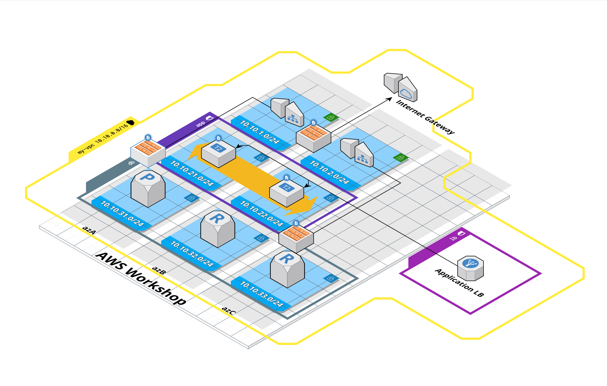

This workshop covers the following topics

1. The creation of a new VPC
2. Internet Gateway
3. Subnets
4. NAT Gateways
5. Route Tables
6. Network Access Control Lists
7. Security Groups
8. EC2 and creation of new instances
9. Bastion host
10. Autoscaling groups
11. Elastic Load Balancers

The following is a high level architecture diagram of the end result we're going to build.


An interactive diagram can be found [here](https://app.cloudcraft.co/view/005b8cfd-95f7-4d19-81a0-e8da1c2d4c63?key=jWz8R9QefwBe7mPq3kOORA).

## 1. VPC

 [A Virtual Private Cloud (VPC)](https://docs.aws.amazon.com/vpc/latest/userguide/what-is-amazon-vpc.html) is a logically isolated section of the AWS Cloud where you can launch AWS resources in a virtual network.

In AWS VPC dashboard, create a new VPC. Name it `<your-name>-vpc` so it's distinguishable from others.
Select IPv4 CIDR block, e.g. `10.10.0.0/16`.

## 2. Internet Gateway

[An internet gateway (IGW)](https://docs.aws.amazon.com/vpc/latest/userguide/VPC_Internet_Gateway.html) is VPC component that allows communication between your VPC and the internet.

In AWS VPC dashboard select the *Internet Gateways* menu option and create a new Internet Gateway.
Name it `<your-name>-igw`.
Attach it to your recently created VPC.

## 3. Subnets

[A subnet](https://docs.aws.amazon.com/vpc/latest/userguide/configure-subnets.html) is a range of IP addresses in your VPC. You can create AWS resources, such as EC2 instances, in specific subnets.

In AWS VPC dashboard, select subnet tab and create 6 subnets.
Use a naming convention so that subnets are easily distinguishable (e.g. `<your-name>-app-1`).

* created subnets should be in your newly created VPC
* use your own scheme for allocating an IPv4 CIDR block for each subnet, e.g. `10.10.1.0/24` for `<your-name>-dmz-1` and `10.10.2.0/24` for `<your-name>-dmz-2`
* create 2 subnets for DMZ, place them in different availability zones
* create 2 subnets for applications, place them in different availability zones
* create 2 subnets for databases, place them in different availability zones
* a region can have several availability zones, place 3 subnets in `az-1` and the rest in `az-2`

> [!NOTE]
> A **Public subnet** is associated with a route table that has a route to an IGW. A **Private subnet** is associated with a route table that hasn't got a route to an IGW.


## 4. NAT Gateway

[A NAT gateway](https://docs.aws.amazon.com/vpc/latest/userguide/vpc-nat-gateway.html) is a Network Address Translation (NAT) service.
NAT gateways are used to enable instances in **private subnets** to initiate connections outside of your VPC while preventing inbound traffic from reaching those instances.
NAT Gateway must be in a **public subnet**

In AWS VPC dashboard, select *NAT Gateways* menu option and create two new NAT Gateway.

* place the first NAT gateway into `dmz-1` and the other one into `dmz-2` subnet
* allocate a new elastic IP addresses for the NAT gateways

> [!NOTE]
> It can take some time for the NAT gateways to be available

## 5. Route tables

[A route table](https://docs.aws.amazon.com/vpc/latest/userguide/VPC_Route_Tables.html) contains a set of rules, called routes, that determine where network traffic from your subnet or gateway is directed.

In AWS VPC dashboard, select *Route Tables*.
We're going to create three route tables.
The first one has a route to the Internet Gateway, the rest will have a route to the NAT Gateway.

Create a route table and name it `<your-name>-rt-igw`.
Place it in your VPC.
It has a _local_ route created for you.
For all other traffic (i.e. `0.0.0.0/0`), add a route to the internet gateway.

Then, create two more route tables and name them `<your-name>-rt-ngw-1` and `<your-name>-rt-ngw-2`
Place them in your VPC and add routes to the NAT gateways.
`rt-ngw-1` should have a route to the NAT gateway that's in subnet `dmz-1`.
`rt-ngw-2` should have a route to the NAT gateway that's in subnet `dmz-2`.

Finally, associate route tables with subnets.
Select `<your-name>-rt-igw` route table and edit its subnet associations.
Associate it with both of your DMZ subnets.
For `<your-name>-rt-ngw-1`, associate it with `app-1` and `db-1` subnets.
`<your-name>-rt-ngw-2` should be associated with `app-2` and `db-2` subnets.

## 6. Network Access Control Lists (NACL)

[Network access control lists](https://docs.aws.amazon.com/vpc/latest/userguide/vpc-network-acls.html) are used to control inbound and outbound traffic on the subnet level.

In AWS VPC dashboard, select *Network ACLs*.
Create three Network Access Control Lists, one for each layer in the infrastructure architecture.
Name them based on the subnet, e.g. `<your-name>-dmz-nacl`, `<your-name>-app-nacl` etc.
Place them into your VPC.
Associate NACLs with their respective subnets.
For example, `<your-name>-dmz-nacl` should be associated with `<your-name>-dmz-1` and `<your-name>-dmz-2`.

Inbound/outbound rules for NACLs are stateless.
This means that for an inbound rule, a matching outbound rule must be created.
Otherwise, traffic can only enter a subnet but can never exit it.
Rules are evaluated in the *rule #* order.

### 6.1 DMZ subnet NACL rules

> [!NOTE]  
> In networking, a DMZ, or Demilitarized Zone, refers to a segmented part of a network that is isolated and positioned between an organization's internal network (often referred to as the "trusted network") and an external network, typically the internet.
> The purpose of a DMZ is to provide an additional layer of security by placing certain servers and services that require external access in a neutral zone with restricted connectivity.

Edit inbound/outbound rules for the `dmz` NACL.
The use cases we want to support are:

* SSH access to bastion host
* app server access to NAT Gateway so they could access the outside world
* incoming HTTP traffic from elastic load balancer

The following is a list of inbound allow rules with their purpose.

| Type            | Protocol | Port Range   | Source        | Description                                                                              |
|-----------------|----------|--------------|---------------|------------------------------------------------------------------------------------------|
| SSH             | TCP      | 22           | 0.0.0.0/0     | Allow SSH access from any source. We want to access our bastion host via SSH             |
| Custom TCP Rule | TCP      | 1024 - 65535 | 0.0.0.0/0     | Allow client traffic to return                                                           |
| HTTP            | TCP      | 80           | 0.0.0.0/0     | Allow incoming HTTP connections from ELB                                                 |
| HTTPS           | TCP      | 443          | 10.10.21.0/24 | Allow incoming HTTPS connections from application servers so they could install packages |
| HTTPS           | TCP      | 443          | 10.10.22.0/24 | Allow incoming HTTPS connections from application servers so they could install packages |
| HTTPS           | TCP      | 443          | 10.10.31.0/24 | Allow incoming HTTPS connections from DB servers so they could install packages          |
| HTTPS           | TCP      | 443          | 10.10.32.0/24 | Allow incoming HTTPS connections from DB servers so they could install packages          |

The following is a list of outbound allow rules with their purpose.

| Type            | Protocol | Port Range   | Destination   | Description                            |
|-----------------|----------|--------------|---------------|----------------------------------------|
| Custom TCP Rule | TCP      | 1024 - 65535 | 0.0.0.0/0     | Allow client return traffic            |
| SSH             | TCP      | 22           | 10.10.21.0/24 | Allow SSH access to app servers        |
| SSH             | TCP      | 22           | 10.10.22.0/24 | Allow SSH access to app servers        |
| SSH             | TCP      | 22           | 10.10.31.0/24 | Allow SSH access to DB servers         |
| SSH             | TCP      | 22           | 10.10.32.0/24 | Allow SSH access to DB servers         |
| HTTP            | TCP      | 80           | 0.0.0.0/0     | Allow HTTP traffic to exit the subnet  |
| HTTPS           | TCP      | 443          | 0.0.0.0/0     | Allow HTTPS traffic to exit the subnet |

### 6.2 App subnet NACL rules

Edit inbound/outbound rules for the `app` NACL.
The use cases we want to support are:

* SSH access from bastion host
* app server access to NAT Gateway so they could access the outside world and download packages
* Incoming HTTP traffic from ELB via `dmz` subnet

The following is a list of inbound allow rules with their purpose.

| Type            | Protocol | Port Range   | Source       | Description                           |
|-----------------|----------|--------------|--------------|---------------------------------------|
| SSH             | TCP      | 22           | 10.10.1.0/24 | Allow SSH access from bastion host    |
| Custom TCP Rule | TCP      | 1024 - 65535 | 0.0.0.0/0    | Allow returning HTTP/S traffic        |
| HTTP            | TCP      | 80           | 10.10.1.0/24 | Allow incoming HTTP traffic from DMZ  |
| HTTP            | TCP      | 80           | 10.10.2.0/24 | Allow HTTP traffic to exit the subnet |

The following is a list of outbound allow rules with their purpose.

| Type            | Protocol | Port Range   | Destination   | Description                                                            |
|-----------------|----------|--------------|---------------|------------------------------------------------------------------------|
| Custom TCP Rule | TCP      | 1024 - 65535 | 10.10.1.0/24  | Allow client return traffic to DMZ                                     |
| Custom TCP Rule | TCP      | 1024 - 65535 | 10.10.2.0/24  | Allow client return traffic to DMZ                                     |
| HTTP            | TCP      | 80           | 0.0.0.0/0     | Allow outbound HTTP traffic (needed to download updates and packages)  |
| HTTPS           | TCP      | 443          | 0.0.0.0/0     | Allow outbound HTTPS traffic (needed to download updates and packages) |
| PostgreSQL      | TCP      | 5432         | 10.10.31.0/24 | Allow DB access to DB subnets                                          |
| PostgreSQL      | TCP      | 5432         | 10.10.32.0/24 | Allow DB access to DB subnets                                          |

### 6.3 DB subnet NACL rules

For DB subnet, we want to support the following use cases.

* SSH access to DB servers from `dmz` subnet
* DB access from `app` subnet
* DB server access to NAT Gateway so it could download updates and packages

The following is a list of inbound allow rules with their purpose.

| Type            | Protocol | Port Range   | Source        | Description                      |
|-----------------|----------|--------------|---------------|----------------------------------|
| SSH             | TCP      | 22           | 10.10.1.0/24  | Allow SSH traffic from DMZ       |
| PostgreSQL      | TCP      | 5432         | 10.10.21.0/24 | Allow DB access from app subnets |
| PostgreSQL      | TCP      | 5432         | 10.10.22.0/24 | Allow DB access from app subnets |
| Custom TCP Rule | TCP      | 1024 - 65535 | 0.0.0.0/0     | Allow returning HTTP/S traffic   |

The following is a list of outbound allow rules with their purpose.

| Type            | Protocol | Port Range   | Destination   | Description                                                                       |
|-----------------|----------|--------------|---------------|-----------------------------------------------------------------------------------|
| Custom TCP Rule | TCP      | 1024 - 65535 | 10.10.1.0/24  | Allow SSH traffic to return to DMZ                                                |
| HTTPS           | TCP      | 443          | 0.0.0.0/0     | Allow HTTPS access to the outside world in order to download packages and updates |
| HTTP            | TCP      | 80           | 0.0.0.0/0     | Allow HTTP access to the outside world in order to download packages and updates  |
| Custom TCP Rule | TCP      | 1024 - 65535 | 10.10.21.0/24 | Allow returning DB traffic to app servers                                         |
| Custom TCP Rule | TCP      | 1024 - 65535 | 10.10.22.0/24 | Allow returning DB traffic to app servers                                         |

## 7. Security Groups (SG)

[Security Groups](https://docs.aws.amazon.com/vpc/latest/userguide/vpc-security-groups.html) are used to control traffic on the instance level.
Compared to NACLs, security group rules are stateful.
There's no need to define a matching outbound rule.
Also, SGs don't have deny rules.

In AWS VPC dashboard, select *Security Groups*.
We're going to create four security groups.
The first one is going to be used for the bastion host.
Second and third groups are going to house app and DB servers respectively.
The fourth one is going to be used by Elastic Load Balancer.
Name your security groups (e.g. `<your-name>-app-sg`), add a description and place them into your VPC.

### 7.1 Bastion host security group

Create a security group that's responsible for the bastion host.
Name it `<your-name>-dmz-sg`.
Edit its inbound rules to only allow access to port 22 (SSH) from all sources.


### 7.2 App server security group

Create a new security group for your app servers.
Name it `<your-name>-app-sg`.
For app servers, we want to allow SSH traffic (port 22) from bastion host security group and HTTP (port 80) traffic from all sources.


### 7.3 DB server security group

Create a security group for DB servers.
Name it `<your-name>-db-sg`.
DB servers need to be accessed via SSH (port 22) from bastion host.
We also want to make sure that app servers can connect to them on port 5432.


### 7.4 ELB security group

Finally, create a security group for a load balancer that we're going to create later.
Name it `<your-name-lb-sg>`.
Allow all incoming HTTP (port 80) traffic from all sources.


## 8. Bastion host

In AWS EC2 dashboard, launch a new instance for the bastion host.
A bastion host is an EC2 instance in a public subnet that's used as a _point of entry_ to access EC2 instances in private subnets.

> [!NOTE]  
> A bastion host, also known as a jump host, is a specially configured and secured server that is positioned on the perimeter of a network, often within a Demilitarized Zone (DMZ).
> The primary purpose of a bastion host is to provide secure access to internal network resources from external networks, such as the internet.

Pick Amazon Linux AMI 2018.03.0 AMI and `t2.micro` as the instance type (it's free tier eligible).
Then click *Configure Instance Details*.
Place the instance in your VPC and select your `dmz-1` subnet.
Also, enable auto-assignment of public IP.
Leave all other options as is.
Click *next* until it's time to configure a security group.
Pick your `dmz-sg` for the security group.
Finally, review and launch the instance.

AWS will ask you to pick a key pair that's used to access the instance.
Crate a new key pair, add a name and then download it.
A `*.pem` file will be downloaded.
You're going to use that later to SSH into the bastion host.
Once that's done, launch the instance.
It will take a bit of time for the instance to be ready.

Once ready, in EC2 dashboard, list your instances and connect to your bastion host by clicking *Connect*.
You'll see instructions on how to SSH into the bastion host using the `pem` file you downloaded previously.
If security groups and network access control lists have been configured correctly, you should be able to successfully establish an SSH session.

```
      __|  __|_  )
      _|  (     /   Amazon Linux AMI
      ___|\___|___|

https://aws.amazon.com/amazon-linux-ami/2018.03-release-notes/
```

If the connection hangs, it could be that there's an issue with NACLs or security groups.

## 9. Application servers

The following section is about creating new EC2 instances that will be serving web traffic.

### 9.1 Launch Template

[Launch template](https://docs.aws.amazon.com/autoscaling/ec2/userguide/launch-templates.html) specifies EC2 instance configuration information.
Auto scaling group will use it to create new EC2 instances.

Create a new launch template.
Name it `<your-name>-lt`.
Use Amazon Linux 2023 AMI and `t2.micro` as the instance type.
Attach the `app` security group to the launch template.

Copy the following to the *User Data* text field.

```
#!/bin/bash
yum update -y
yum install -y httpd
service httpd start
echo "<h1>Hello from $HOSTNAME</h1>" > /var/www/html/index.html
```

This script is executed when the instance starts.
It will install the Apache webserver.

### 9.2 Auto Scaling Group

[An Auto Scaling group](https://docs.aws.amazon.com/autoscaling/ec2/userguide/auto-scaling-groups.html) contains a collection of EC2 instances that are treated as a logical grouping for the purposes of automatic scaling and management

In the EC2 dashboard, create a new auto scaling group.
Name it `<your-namee>-asg`.
Next, select the launch template that you created in the previous step.
In the next section, configure the auto scaling group to use your VPC.
To ensure that EC2 instances are created in the correct subnets, select the `app-1` and `app-2` subnets.

In the *Configure advanced options* leave everything as is.
In *group size and scaling* set the min and desired capacity to 2.
Click next until you can create the auto scaling group.

Once the auto scaling group is created, AWS will start creating new EC2 instances.
View the *Instances* section in the EC2 dashboard to see the status of the newly created EC2 instances.

## 10. Load Balancing

### 10.1 Target Group

[Target groups](https://docs.aws.amazon.com/elasticloadbalancing/latest/application/load-balancer-target-groups.html) route requests to individual registered targets, such as EC2 instances, using the protocol and port number that you specify.
In our case, it specifies the *targets* our load balancer should direct traffic to.

In AWS EC2 dashboard, create a new target group.
Set the target type to *instances*.
Specify the name (e.g. `<your-name>-tg`), select your VPC and use HTTP for the protocol.
Leave everything else as is.

At the moment, the target group you created is empty.
It hasn't got any associated EC2 instances yet.
We could add them manually, but since our applications are in an auto scaling group, we would like to avoid manual work.
New instances in an auto scaling group are created and removed automatically.

Open the auto scaling group `<your-name>-asg` and edit its load balancing configuration.
Tick the *Application, Network or Gateway Load Balancer target groups* checkbox and from the dropdown select your target group.
This registers all instances in the auto scaling group with the target group.
View your target group again.
After a bit of time, you should see all of your EC2 instances in your auto scaling group as targets in the target group.

> [!NOTE]
> In addition to appearing in the target group, it takes a bit of time for health checks to pass

### 10.2 Load Balancer

In the AWS EC2 dashboard, go to *Load Balancers* and create an Application Load Balancer.
Add a name (e.g. `<your-name>-app-lb`) and set the scheme to internet-facing.
Leave the listeners as is.
In Network mapping, select your VPC and enable it for both availability zones.
Select a *public* subnet per availability zone.
In our case, we've created two public subnets — `dmz-1` and `dmz-2`.
Tick the availability zones the public sunets were created in and select the subnets that should be associated with the load balancer.

In the security group section, select the existing `<your-name>-lb-sg` security group.

In the listeners and rounting section, configure HTTP port 80 to be routed to the target group you created in the previous section.

It takes a bit of time for the provisioning to finish.
Meanwhile you can move onwards with the next steps.

> [!NOTE]
> **Application load balancer** works on layer 7 of the OSI model (HTTP/HTTPS).
> It supports host and path based routing.
> It can also route to different applications on a single EC2 instance based on port.
>
> **Network load balancer** works on layer 4 of the OSI model and is more performant than application LB.

Once the load balancer has been created, find its URL and try to access your web servers.
If everything is configured correctly, you should receive an HTTP response similar to the following image.


Hit refresh a couple of times and you should see that the response comes from different servers.

## 11. Databases

Let's create two EC2 instances that are going to be used as database servers.
In AWS EC2 dashboard, launch a new instance.
Use Amazon Linux AMI 2018.03.0 AMI and `t2.micro` as the instance type. 
Click next to configure instance details.
Select your VPC and place the instance into your `db-1` subnet.
In advanced details, copy-and-paste the following user data script.

```
#!/bin/bash
yum update -y
yum install -y postgresql-server
service postgresql initdb
echo "listen_addresses = '*'" >> /var/lib/pgsql9/data/postgresql.conf
echo "host all all 0.0.0.0/0 trust" >> /var/lib/pgsql9/data/pg_hba.conf
service postgresql start
```

It will download PostgreSQL and configure it to accept connections.

Click next until you can configure security groups.
Select your existing `db-sg` as the security group.
Finally, launch the instance. 
Make sure you select your existing keypair.

Repeat the procedure but this time place the second DB instance into `db-2` subnet.

Once instances have been created and provisioned, try to SSH into them via bastion host.
If you're having trouble connecting, verify that security group rules and NACLs allow SSH connections.

Finally, SSH into your app servers and verify that they can connect to the PostgreSQL server running on DB servers.
In app servers, run the following to verify whether TCP connection to port `5432` is allowed.

```
nc -vz <enter DB server IP here> 5432
```

A successful response would look something like the following

```
Connection to 10.10.31.96 5432 port [tcp/postgres] succeeded!
```
